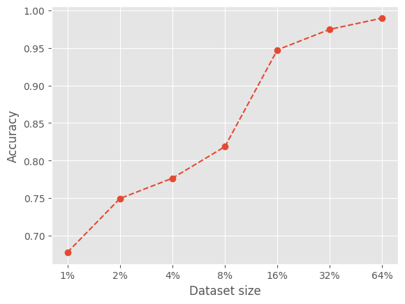

# On the Compositional Skills of Sequence-to-Sequence Transformers

This repository implements a standard encoder-decoder transformer model for
the SCAN task, as put forth in [Brendan Lake & Marco Beroni, 2018](http://proceedings.mlr.press/v80/lake18a/lake18a.pdf)

# Data

The data can be downloaded by running:
`chmod u+x ./download_data.sh`
`./download_data.sh`
# Implementation

Models were tuned with an informal hyperparameter search on the "simple" task. In the paper, it seem like they use a batch size of 1 for training, so this is also the default in this repository. The best configuration was:

| hyperparameter    | Value  |
| ----------------- | ------ |
| `lr`              | 0.0003 |
| `layers`          | 2      |
| `hidden_size`     | 128    |
| `attention_heads` | 2      |
| `epochs`          | 5      |

This gives a model of approximately 850 000 parameters, roughly the same as the LSTM models used in the paper. The models could easily run on CPU on the Apple M1. 

## Results

  
   
  <em>Results of the "simple" task for different dataset sizes..</em>

For the length productivity task, the model got a 82.27% accuracy.

